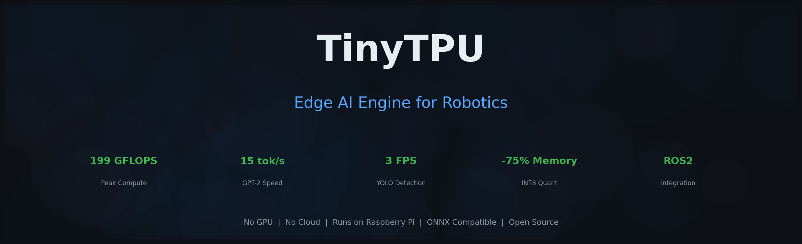

<p align="center">
  
</p>

<p align="center">
  <b>A lightweight, educational AI inference engine that runs on Raspberry Pi</b><br>
  No GPU • No Cloud • ONNX Compatible • ROS2 Ready
</p>

<p align="center">
  <a href="#quick-start">Quick Start</a> •
  <a href="#benchmarks">Benchmarks</a> •
  <a href="#onnx-engine">ONNX Engine</a> •
  <a href="#ros2-robotics">ROS2 Robotics</a> •
  <a href="#deployment">Deployment</a>
</p>

---

## What is TinyTPU?

TinyTPU is a complete AI inference stack designed for resource-constrained devices. It includes a systolic array RTL design, a Python API with PyTorch/NumPy backends, an ONNX runtime supporting 50+ operators, INT8 quantization, and a full ROS2 robotics package — all running without a GPU.

**Key capabilities:**
- **199 GFLOPS peak** matrix multiply performance
- **15 tokens/sec** GPT-2 text generation
- **13 FPS** MobileNetV2 image classification
- **3 FPS** YOLOv5 real-time object detection
- **75% memory reduction** with INT8 quantization
- **1.0 correlation** with ONNX Runtime (identical outputs)

<p align="center">
  
</p>

---

## Quick Start

### Installation
```bash
git clone https://github.com/SKBiswas1998/tinytpu.git
cd tinytpu
pip install numpy torch onnx onnxruntime
```

### Run Object Detection
```python
from software.tinytpu.onnx_engine import TinyTPUEngine
import numpy as np

# Load any ONNX model
engine = TinyTPUEngine("yolov5n.onnx")

# Run inference
image = np.random.rand(1, 3, 640, 640).astype(np.float32)
output, elapsed = engine.run({"images": image})
print(f"Inference: {elapsed*1000:.0f}ms")
```

### Run GPT-2 Text Generation
```python
from software.tinytpu.gpt2_optimized import generate

text = generate("The future of robotics is", max_tokens=50)
print(text)  # 11-15 tokens/sec
```

### Run with INT8 Quantization (75% less memory)
```python
engine = TinyTPUEngine("mobilenetv2.onnx", quantize=True)
# FP32: 13.3MB → INT8: 3.4MB
```

---

## Benchmarks

<p align="center">
  
</p>

### Matrix Multiply

| Size | Time | GFLOPS |
|------|------|--------|
| 128×128 | 0.15ms | 28.3 |
| 256×256 | 0.32ms | 104.7 |
| 512×512 | 1.78ms | 150.8 |
| 1024×1024 | 10.78ms | **199.2** |
| 2048×2048 | 200.4ms | 85.7 |

### Neural Operations vs PyTorch (1000×768)

| Operation | TinyTPU | PyTorch | Speedup |
|-----------|---------|---------|---------|
| relu | 0.34ms | 0.57ms | **1.7×** |
| gelu | 1.24ms | 1.59ms | **1.3×** |
| layer_norm | 1.83ms | 2.10ms | **1.1×** |
| softmax | 1.44ms | 1.35ms | 0.9× |

### Model Inference

| Model | Task | TinyTPU | ONNX Runtime | Correlation |
|-------|------|---------|-------------|-------------|
| MobileNetV2 | Classification | 13.3 FPS | 171 FPS | **1.000000** |
| YOLOv5-nano | Detection | 3.1 FPS | 11.5 FPS | **1.000000** |
| GPT-2 124M | Generation | 15 tok/s | — | — |

---

## Systolic Array

TinyTPU implements a systolic array architecture for efficient matrix multiplication — the core operation behind neural networks.

<p align="center">
  
</p>

Each Processing Element (PE) performs one multiply-accumulate per clock cycle. Data flows through the array in a wavefront pattern, maximizing throughput while minimizing memory access.

---

## ONNX Engine

The ONNX engine loads and runs any ONNX model with 50+ supported operators. It automatically selects between PyTorch (fast) and NumPy (portable) backends.

<p align="center">
  
</p>

### Supported Operators

**Core:** MatMul, Gemm, Conv, Add, Sub, Mul, Div
**Activations:** Relu, Sigmoid, Tanh, Softmax, Clip, GELU
**Pooling:** MaxPool, AveragePool, GlobalAveragePool, BatchNorm, LayerNorm
**Shape:** Reshape, Transpose, Flatten, Squeeze, Unsqueeze, Concat, Gather, Slice, Split
**Math:** Sqrt, Pow, Exp, Log, Abs, Floor, Ceil, Pad, Resize, Cast
**Reduction:** ReduceMean, ReduceSum
**Logic:** Where, Equal, Less, Greater, Not
**Special:** Constant, ConstantOfShape, Shape, Identity, Dropout

### Usage
```python
from software.tinytpu.onnx_engine import TinyTPUEngine

# Load model with optional INT8 quantization
engine = TinyTPUEngine("model.onnx", quantize=True)

# View model info
engine.summary()

# Run inference
output, elapsed = engine.run({"input": data})

# Benchmark
stats = engine.benchmark({"input": data}, runs=10)
print(f"Mean: {stats['mean_ms']:.1f}ms, FPS: {stats['fps']:.1f}")
```

---

## INT8 Quantization

<p align="center">
  
</p>

Symmetric per-tensor quantization reduces memory by 75% with near-zero accuracy loss:

| Model | FP32 Memory | INT8 Memory | Savings | Correlation |
|-------|------------|-------------|---------|-------------|
| GPT-2 124M | 471 MB | 118 MB | **-75%** | 0.9999+ |
| MobileNetV2 | 13.3 MB | 3.4 MB | **-74%** | 0.9999+ |
| YOLOv5-nano | 3.6 MB | 0.9 MB | **-75%** | 0.9999+ |

---

## ROS2 Robotics

TinyTPU includes a complete ROS2 package for autonomous robot control with three nodes:

<p align="center">
  
</p>

### Nodes

- **Vision Node** — Camera → YOLOv5 object detection → `/tinytpu/detections`
- **LLM Node** — Natural language understanding → scene description → command parsing
- **Brain Node** — Combines vision + LLM → `/cmd_vel` motor commands

### Behavior Modes

| Mode | Description |
|------|-------------|
| `follow_person` | Track and follow detected person |
| `avoid_obstacles` | Navigate while avoiding objects |
| `explore` | Wander and describe environment |
| `command` | Wait for voice/text commands |

### Natural Language Commands
```
"follow the person"    → follow mode, track person
"what do you see"      → describe visible objects
"find the cup"         → rotate and search
"turn left"            → angular velocity command
"stop"                 → halt all movement
"go back"              → reverse
```

<p align="center">
  
</p>

### ROS2 Launch
```bash
# Build
cd ros2/tinytpu_ros
colcon build --packages-select tinytpu_ros
source install/setup.bash

# Launch all nodes
ros2 launch tinytpu_ros tinytpu_launch.py

# Or run individually
ros2 run tinytpu_ros vision_node
ros2 run tinytpu_ros llm_node
ros2 run tinytpu_ros brain_node

# Send commands
ros2 topic pub /tinytpu/llm_input std_msgs/String \
  '{"type":"command","prompt":"follow the person"}'

# Monitor
ros2 topic echo /cmd_vel
ros2 topic echo /tinytpu/detections
```

### Standalone (No ROS Required)
```python
from ros2.tinytpu_ros.tinytpu_ros.vision_node import VisionProcessor
from ros2.tinytpu_ros.tinytpu_ros.brain_node import BrainProcessor

vision = VisionProcessor("yolov5n.onnx")
brain = BrainProcessor(mode="follow_person")

# Camera loop
detections, _ = vision.detect(camera_frame)
command = brain.process(detections)
robot.set_velocity(command['linear_x'], command['angular_z'])
```

---

## Deployment

<p align="center">
  
</p>

### Raspberry Pi 4/5
```bash
# Install dependencies
pip install numpy torch onnx onnxruntime opencv-python

# Clone and run
git clone https://github.com/SKBiswas1998/tinytpu.git
cd tinytpu
python test_robotics.py
```

**Expected performance on Pi 5:**
- MobileNetV2: ~3-5 FPS
- YOLOv5-nano: ~1-2 FPS
- GPT-2: ~3-5 tok/s

### Estimated Performance by Device

| Device | RAM | MobileNet | YOLOv5 | GPT-2 |
|--------|-----|-----------|--------|-------|
| Desktop (x86) | 16GB | 13 FPS | 3 FPS | 15 tok/s |
| Raspberry Pi 5 | 4-8GB | 3-5 FPS | 1-2 FPS | 3-5 tok/s |
| Raspberry Pi 4 | 2-4GB | 1-3 FPS | <1 FPS | 1-3 tok/s |
| Jetson Nano | 4GB | 10-20 FPS | 5-10 FPS | 5-10 tok/s |

---

## Roadmap

<p align="center">
  
</p>

- [x] **Phase 1: Core Engine** — Systolic array, Python API, GPT-2, INT8 quantization, ONNX engine
- [x] **Phase 2: Perception** — MobileNetV2, YOLOv5, NMS, accuracy validation
- [x] **Phase 3: Robotics** — ROS2 package, vision + LLM + brain nodes, natural language commands
- [ ] **Phase 4: Deployment** — Live camera, Raspberry Pi testing, MicroROS, PyPI package
- [ ] **Phase 5: Advanced** — SLAM, voice commands, TinyLlama, FPGA deployment

---

## Project Structure
```
tinytpu/
├── software/tinytpu/
│   ├── tpu_v2.py                 # Core TinyTPU engine
│   ├── int8_quantization.py      # INT8 quantization
│   ├── gpt2_optimized.py         # LLM inference
│   └── onnx_engine/
│       └── engine.py             # ONNX runtime (50+ ops)
├── ros2/tinytpu_ros/
│   ├── tinytpu_ros/
│   │   ├── vision_node.py        # Camera → YOLO → detections
│   │   ├── llm_node.py           # NL understanding + commands
│   │   └── brain_node.py         # Decision making → /cmd_vel
│   ├── launch/
│   │   └── tinytpu_launch.py     # ROS2 launch file
│   └── config/
│       └── tinytpu_config.yaml   # Configuration
├── docs/images/                   # README diagrams
├── test_onnx.py                   # MobileNetV2 test
├── test_yolo.py                   # YOLOv5 test
├── test_robotics.py               # Full pipeline test
└── speed_test.py                  # Performance benchmark
```

---

## License

MIT

---

<p align="center">
  Built for robots that think at the edge.
</p>
