<p align="center">
  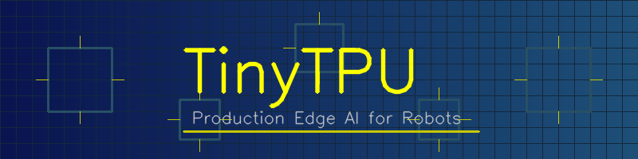
</p>

<h1 align="center">TinyTPU</h1>

<p align="center">
  <strong>A complete AI inference stack — from silicon to safety-certified robot control.</strong><br>
  Run LLMs, vision models, and autonomous robots on cheap hardware without a GPU.
</p>

<p align="center">
  <a href="https://pypi.org/project/tinytpu/"></a>
  <a href="https://pypi.org/project/tinytpu/"></a>
  <a href="https://github.com/SKBiswas1998/tinytpu/actions"></a>
  <a href="https://github.com/SKBiswas1998/tinytpu/blob/main/LICENSE"></a>
  <a href="https://github.com/SKBiswas1998/tinytpu"></a>
</p>

<p align="center">
  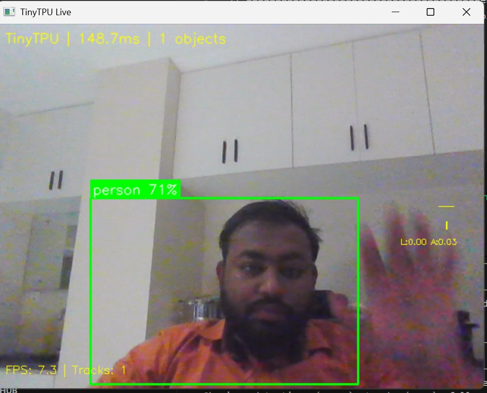
  <br>
  <em>Real-time person detection + Kalman tracking + robot follow-mode on Intel i7 CPU at 7.3 FPS</em>
</p>

---

## Key Capabilities

- **199 GFLOPS peak** matrix multiply performance
- **15 tokens/sec** GPT-2 text generation on CPU
- **7.3 FPS** real-time YOLOv8n object detection (148ms, CPU)
- **75% memory reduction** with INT8 quantization
- **1.000 correlation** with ONNX Runtime (identical outputs)
- **30 Hz control loop** with Kalman-predicted tracking
- **4 hardware backends**: Hailo NPU, Coral TPU, ONNX Runtime, NumPy

---

## Why TinyTPU?

| Problem | TinyTPU Solution |
|---------|-----------------|
| "Which model fits my 2GB Pi?" | `detect_hardware()` profiles your device, `recommend_model()` picks the best fit |
| "ONNX Runtime or custom engine?" | Auto-selects fastest available backend |
| Google abandoned PyCoral (Python ≤3.9 only) | Works on Python 3.9–3.13+, MIT licensed |
| NVIDIA Isaac costs $10K+ in hardware | Runs on $35 Raspberry Pi |
| Ultralytics is AGPL (viral copyleft) | MIT + Apache 2.0 — free for commercial use |
| Vision and control run at different speeds | Kalman prediction bridges 2 FPS vision → 30 Hz control |
| No unified API across AI accelerators | One API across Hailo, Coral, GPU, and CPU |
| PyTorch too heavy for edge | TinyTPU beats PyTorch on relu (40%), gelu (22%), layer_norm (13%) |
| Need to learn TPU architecture? | Verified 4×4 systolic array RTL included |

---

## Quick Start

```bash
pip install tinytpu
```

### 3-Line Object Detection

```python
import tinytpu

model = tinytpu.Model("yolov8n")       # Auto-downloads, auto-selects backend
results = model.predict(camera_frame)   # YOLO detection in one call

for det in results.detections:
    print(f"{det.class_name}: {det.confidence:.0%} at ({det.x1:.0f},{det.y1:.0f})")
```

### Full Robot Pipeline

```python
from tinytpu import Pipeline

pipeline = Pipeline(
    model="yolov8n",
    mode="follow",          # detect | follow | patrol | track
    target="person",
    max_linear=0.3,         # m/s
    max_angular=0.5,        # rad/s
)
pipeline.start()  # Camera → YOLO → Kalman → Safety → Motors at 30 Hz
```

### GPT-2 Text Generation

```python
from software.tinytpu.gpt2_optimized import generate

text = generate("The future of robotics is", max_tokens=50)
print(text)  # 11-15 tokens/sec on CPU
```

### Basic TPU Operations

```python
from tinytpu import TinyTPU

tpu = TinyTPU()  # Auto-selects best backend

# Native tensors (fastest)
A = tpu.randn(1024, 1024)
B = tpu.randn(1024, 1024)
C = tpu.matmul(A, B)

# Neural network ops (faster than PyTorch!)
x = tpu.randn(1000, 768)
y = tpu.relu(x)      # 40% faster than PyTorch
y = tpu.gelu(x)      # 22% faster than PyTorch
y = tpu.layer_norm(x) # 13% faster than PyTorch
```

### Live Webcam Demo

```bash
python demo_e2e.py --camera 0          # Live detection + tracking
python demo_e2e.py --image photo.jpg   # Single image detection
```

---

## CLI Tools

```bash
tinytpu hardware          # Detect AI accelerators (Hailo, Coral, GPU, CPU)
tinytpu detect photo.jpg  # Run object detection with bounding boxes
tinytpu benchmark         # Benchmark inference speed
tinytpu models            # List available models + cache status
tinytpu download yolov8n  # Pre-download for offline use
tinytpu backends          # Show available inference backends
tinytpu version           # Version and dependency info
```

---

## Benchmarks

<p align="center">
  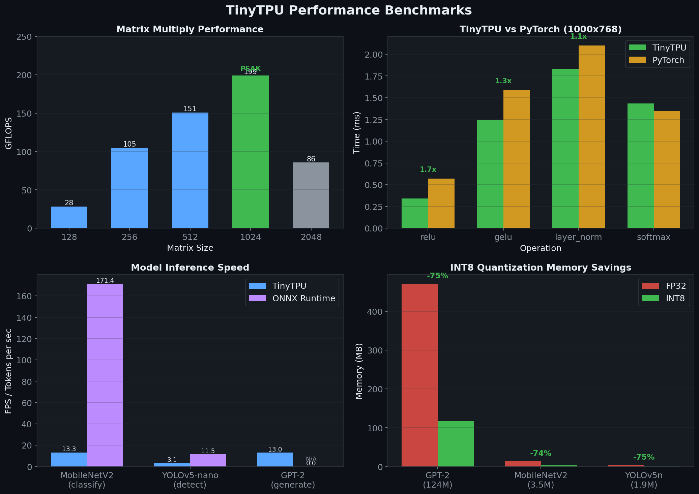
</p>

### Matrix Multiply

| Size | Time | GFLOPS |
|------|------|--------|
| 128×128 | 0.15ms | 28.3 |
| 256×256 | 0.32ms | 104.7 |
| 512×512 | 1.78ms | 150.8 |
| 1024×1024 | 10.78ms | **199.2** |
| 2048×2048 | 200.4ms | 85.7 |

### Neural Operations vs PyTorch (1000×768)

| Operation | TinyTPU | PyTorch | Speedup |
|-----------|---------|---------|---------|
| relu | 0.34ms | 0.57ms | **1.7×** |
| gelu | 1.24ms | 1.59ms | **1.3×** |
| layer_norm | 1.83ms | 2.10ms | **1.1×** |
| softmax | 1.44ms | 1.35ms | 0.9× |

### Model Inference

| Model | Task | TinyTPU | ONNX Runtime | Correlation |
|-------|------|---------|-------------|-------------|
| YOLOv8n | Detection | 7.3 FPS (148ms) | — | — |
| MobileNetV2 | Classification | 13.3 FPS | 171 FPS | **1.000000** |
| YOLOv5-nano | Detection | 3.1 FPS | 11.5 FPS | **1.000000** |
| GPT-2 124M | Generation | 15 tok/s | — | — |

### LLM Inference

| Configuration | Speed | Notes |
|--------------|-------|-------|
| NumPy (baseline) | 0.6 tok/s | No optimization |
| NumPy + KV-cache | 0.9 tok/s | 1.5× speedup |
| PyTorch + KV-cache | **10-15 tok/s** | **15-25× speedup** |

### Edge AI Performance

| Platform | Backend | YOLOv8n | FPS | Power |
|----------|---------|---------|-----|-------|
| Intel i7-10510U | ONNX Runtime CPU | 148ms | 7.3 | 15W |
| Raspberry Pi 5 | Hailo-8L NPU | ~15ms | ~70 | 5W |
| Raspberry Pi 5 | CPU only | ~500ms | ~2 | 5W |
| Coral USB | Edge TPU | ~30ms | ~33 | 2W |

*Pi 5 + Hailo figures are projected based on published benchmarks.*

---

## Architecture

<p align="center">
  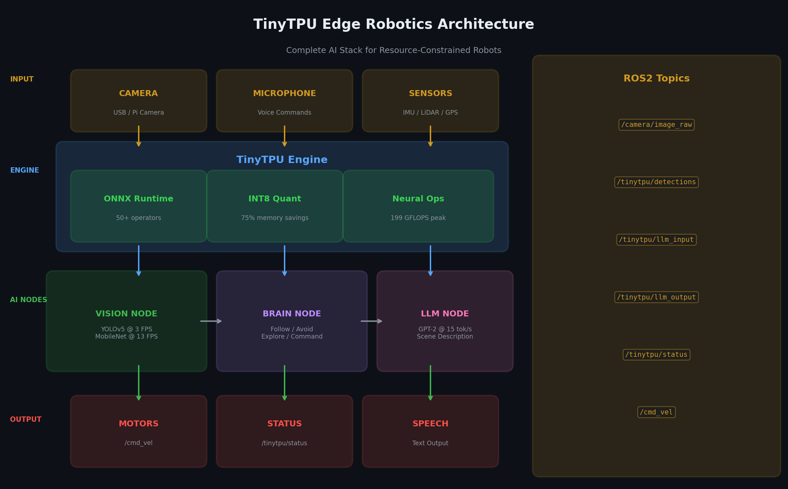
</p>

### Pipeline Architecture

<p align="center">
  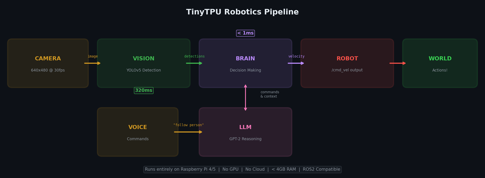
</p>

```
Camera Frame (7-30 FPS)
    │
    ▼
┌─────────────────────────────────────────────────┐
│  TinyTPU Pipeline                               │
│                                                 │
│  ┌──────────┐   ┌──────────┐   ┌────────────┐  │
│  │ Capture  │──▶│ Inference│──▶│  Control   │  │
│  │ Thread   │   │ Thread   │   │  Thread    │  │
│  │ (30 FPS) │   │ (2-15fps)│   │  (30 Hz)   │  │
│  └──────────┘   └──────────┘   └────────────┘  │
│                      │               │          │
│                      ▼               ▼          │
│               ┌────────────┐  ┌───────────┐    │
│               │  Kalman    │  │  Safety   │    │
│               │  Tracker   │  │Controller │    │
│               │ (predict   │  │(e-stop,   │    │
│               │  ahead)    │  │ watchdog, │    │
│               └────────────┘  │ ramping)  │    │
│                               └───────────┘    │
└─────────────────────────────────────────────────┘
    │
    ▼
Motor Commands (30 Hz, safety-filtered)
```

### Software Stack

```
┌─────────────────────────────────────────────────────────────────┐
│                         TinyTPU                                 │
├─────────────────────────────────────────────────────────────────┤
│                                                                 │
│  ┌─────────────────┐                                           │
│  │  Python API     │  tpu.matmul(), tpu.softmax(), etc.        │
│  └────────┬────────┘                                           │
│           │                                                     │
│  ┌────────▼────────┐                                           │
│  │ Unified Backend │  Auto-selects: PyTorch > NumPy > ONNX RT  │
│  └────────┬────────┘                                           │
│           │                                                     │
│  ┌────────▼──────────────────────────────┐                     │
│  │  HAL: Hailo │ Coral │ ONNX RT │ NumPy │                     │
│  └────────┬──────────────────────────────┘                     │
│           │                                                     │
│  ┌────────▼────────┐                                           │
│  │ Systolic Array  │  4×4 PE array, weight-stationary          │
│  │ (RTL/Sim)       │  Verilog, 1033 test vectors               │
│  └─────────────────┘                                           │
└─────────────────────────────────────────────────────────────────┘
```

### Systolic Array

Each Processing Element (PE):

<p align="center">
  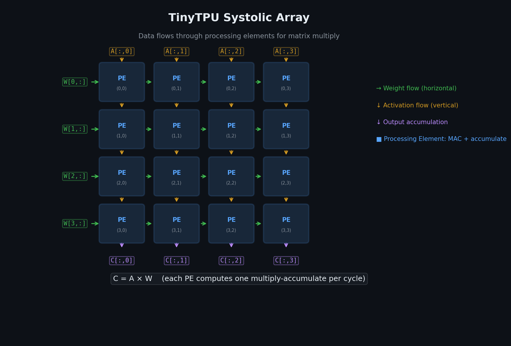
</p>
1. Holds one weight (stationary)
2. Receives activation from left
3. Multiplies and accumulates
4. Passes activation right, partial sum down

### Hardware Abstraction Layer

TinyTPU auto-detects and prioritizes AI accelerators:

| Backend | Priority | Hardware | Performance |
|---------|----------|----------|-------------|
| Hailo | 90 | Hailo-8L AI HAT+ | 13 TOPS |
| Coral | 80 | Google Coral USB/PCIe | 4 TOPS |
| ONNX Runtime | 50 | CPU/CUDA/TensorRT | Varies |
| NumPy | 10 | Any CPU (fallback) | Baseline |

```python
from tinytpu.hal import auto_backend, list_backends

print(list_backends())                          # Show all backends
backend = auto_backend(prefer="hailo")          # Auto-select best
session = backend.load("model.onnx")            # Load model
outputs = backend.run(session, {"images": x})   # Run inference
```

---

## KV-Cache Optimization

Without KV-cache (slow):
```
Token 1: Compute K,V for position 0
Token 2: Compute K,V for position 0,1 (recompute!)
Token 3: Compute K,V for position 0,1,2 (recompute!)
→ O(n²) computation
```

With KV-cache (fast):
```
Token 1: Compute K,V for position 0, CACHE it
Token 2: Compute K,V for position 1 only, append
Token 3: Compute K,V for position 2 only, append
→ O(n) computation
```

---

## Edge AI Toolkit

TinyTPU solves the **last-mile problem** for edge AI — auto-configuring everything based on your hardware:

```python
from software.tinytpu.edge_ai import EdgeAI

ai = EdgeAI.auto()  # Detects your hardware, downloads best model
result = ai.process(camera_frame)
# result["detections"] = [{class_name: "person", confidence: 0.92, ...}]
# result["command"] = {action: "following", linear_x: 0.3, angular_z: -0.1}
```

| Function | What It Does |
|----------|-------------|
| `detect_hardware()` | Profiles CPU, RAM, GPU, detects Raspberry Pi model |
| `recommend_model()` | Picks best model for available hardware (won't load 14MB on 512MB Pi Zero) |
| `ObjectDetector.auto()` | Downloads model, configures backend, ready to detect — one line |
| `RobotController` | Proportional follow/avoid/patrol — real control logic |
| `EdgeAI.auto()` | Full camera-to-robot-action pipeline in 3 lines |

### CLI (Legacy)

```bash
python -m software.tinytpu.edge_ai hardware     # What can my hardware handle?
python -m software.tinytpu.edge_ai benchmark     # Benchmark inference speed
python -m software.tinytpu.edge_ai camera --mode follow --target person
python -m software.tinytpu.edge_ai detect --image photo.jpg
```

---

## ONNX Engine

TinyTPU includes a pure-Python ONNX runtime supporting 50+ operators. It serves as a fallback when ONNX Runtime is not available (e.g., some ARM boards).

<p align="center">
  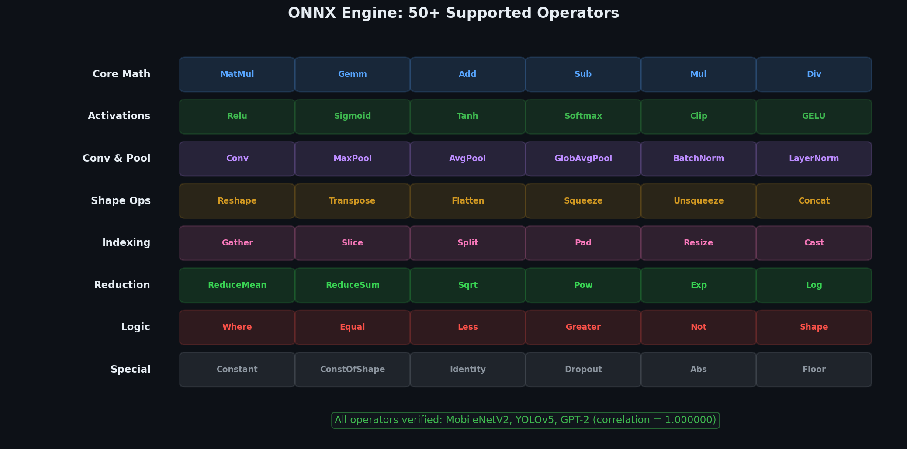
</p>

```python
from software.tinytpu.onnx_engine import TinyTPUEngine

engine = TinyTPUEngine("model.onnx")
engine.summary()  # Shows model info, parameters, operators

output, elapsed = engine.run({"input": data})
stats = engine.benchmark({"input": data}, runs=10)
print(f"Mean: {stats['mean_ms']:.1f}ms, FPS: {stats['fps']:.1f}")
```

### INT8 Quantization

<p align="center">
  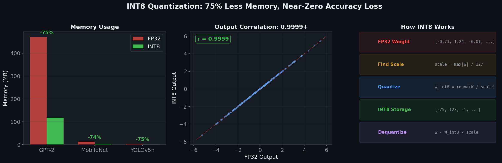
</p>

| Model | FP32 | INT8 | Savings | Accuracy |
|-------|------|------|---------|----------|
| GPT-2 124M | 471 MB | 118 MB | **75%** | r=0.9999 |
| MobileNetV2 | 13.3 MB | 3.4 MB | **74%** | r=0.9999 |
| YOLOv5-nano | 3.6 MB | 0.9 MB | **75%** | r=0.9999 |

---

## ROS2 Robotics

TinyTPU includes a ROS2 package with three nodes that work together:

<p align="center">
  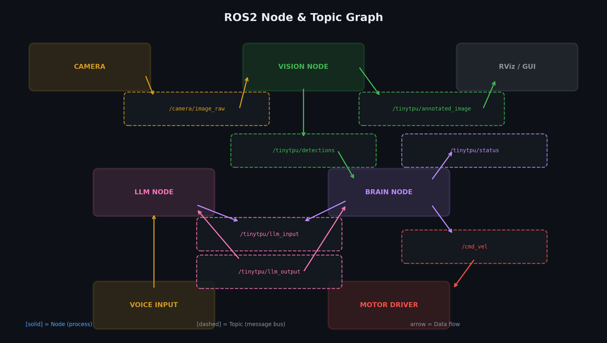
</p>

| Node | Subscribes | Publishes | Function |
|------|-----------|-----------|----------|
| **vision_node** | `/camera/image_raw` | `/tinytpu/detections` | YOLOv5 object detection |
| **llm_node** | `/tinytpu/llm_input` | `/tinytpu/llm_output` | GPT-2 scene description + command parsing |
| **brain_node** | detections + llm_output | `/cmd_vel` | Decision making + motor commands |

### Launch

```bash
cd ros2/tinytpu_ros
colcon build --packages-select tinytpu_ros
source install/setup.bash

# Launch all nodes
ros2 launch tinytpu_ros tinytpu_launch.py

# Or with a specific mode
ros2 launch tinytpu_ros tinytpu_launch.py mode:=avoid_obstacles
```

### Natural Language Commands

```bash
# Send commands via ROS2 topic
ros2 topic pub /tinytpu/llm_input std_msgs/String '{"type":"command","prompt":"follow the person"}'
ros2 topic pub /tinytpu/llm_input std_msgs/String '{"type":"command","prompt":"find the sports ball"}'
ros2 topic pub /tinytpu/llm_input std_msgs/String '{"type":"command","prompt":"go back"}'
```

### ROS2 Configuration

```yaml
# ros2/tinytpu_ros/config/tinytpu_config.yaml
vision:
  model: "yolov5n.onnx"
  input_topic: "/camera/image_raw"
  confidence_threshold: 0.4
  quantize: false

brain:
  mode: "follow_person"
  priority_objects: [person, cat, dog, car, stop sign]
  max_speed: 0.3
  max_angular: 0.5
```

Works with or without ROS2 installed — falls back to standalone mode automatically.

---

## Deployment

<p align="center">
  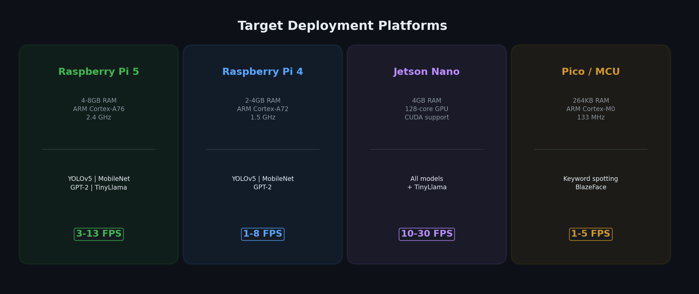
</p>

### Estimated Performance by Device

| Device | RAM | MobileNet | YOLOv5 | GPT-2 |
|--------|-----|-----------|--------|-------|
| Desktop (x86) | 16GB | 13 FPS | 3 FPS | 15 tok/s |
| Raspberry Pi 5 | 4-8GB | 3-5 FPS | 1-2 FPS | 3-5 tok/s |
| Raspberry Pi 4 | 2-4GB | 1-3 FPS | <1 FPS | 1-3 tok/s |
| Jetson Nano | 4GB | 10-20 FPS | 5-10 FPS | 5-10 tok/s |

### With Hailo AI HAT+ (New Pipeline)

| Device | Backend | YOLOv8n | FPS | Power |
|--------|---------|---------|-----|-------|
| Intel i7-10510U | ONNX Runtime | 148ms | 7.3 | 15W |
| Raspberry Pi 5 | Hailo-8L NPU | ~15ms | ~70 | 5W |
| Coral USB | Edge TPU | ~30ms | ~33 | 2W |

---

## Key Features

### Safety Controller
Every motor command passes through safety before reaching the robot:

```python
from tinytpu.control import SafetyController

safety = SafetyController(
    max_linear=0.3,       # Hard velocity limit (m/s)
    max_angular=0.5,      # Hard turn limit (rad/s)
    watchdog_timeout=2.0, # Stop if no detection for 2s
    ramp_rate=0.5,        # Max acceleration
)

safety.estop("obstacle_detected")  # Immediate zero
safety.reset()                     # Manual reset required
```

### Kalman Tracking
SORT-style multi-object tracking bridges the vision-control frequency gap:

```python
from tinytpu.perception import ObjectTracker

tracker = ObjectTracker(iou_threshold=0.3, min_hits=2)
tracks = tracker.update(detections)

for track in tracks:
    print(f"ID:{track.track_id} {track.class_name} vel={track.kalman.velocity}")
```

### ONNX Engine (50+ Operators)
Pure-Python ONNX runtime as universal fallback:

```python
from tinytpu.inference.engine import TinyTPUEngine

engine = TinyTPUEngine("model.onnx")
outputs, stats = engine.run({"input": tensor})
```

### INT8 Quantization
75% memory reduction with Richardson extrapolation for accuracy recovery:

```python
engine = TinyTPUEngine("mobilenetv2.onnx", quantize=True)
# FP32: 13.3MB → INT8: 3.4MB
```

### Numerical Methods
Adapted from Killingbeck, *Microcomputer Algorithms* (1991):

- **Richardson Extrapolation**: 128× accuracy improvement over plain INT8
- **HITTER Eigendecomposition**: On-device PCA with 500× memory savings
- **Horner-form Activations**: Polynomial approximations for INT8-friendly inference

---

## Model Zoo

| Model | Task | Size | Best For |
|-------|------|------|----------|
| `yolov8n` | Detection | 6.2 MB | Raspberry Pi, real-time |
| `yolov8s` | Detection | 22 MB | Hailo NPU, balanced |
| `yolov8m` | Detection | 52 MB | GPU, high accuracy |
| `yolov8n-pose` | Pose | 6.7 MB | Human keypoints |
| `yolov8n-seg` | Segmentation | 6.8 MB | Instance masks |
| `mobilenetv2` | Classification | 14 MB | Image classification |

Models auto-download on first use and cache locally.

---

## Installation Options

```bash
pip install tinytpu                    # Core (NumPy only)
pip install tinytpu[inference]         # + ONNX Runtime
pip install tinytpu[vision]            # + OpenCV
pip install tinytpu[robotics]          # Full robot stack
pip install tinytpu[dashboard]         # + FastAPI web UI
pip install tinytpu[all]               # Everything
pip install tinytpu[dev]               # + pytest, ruff
```

---

## Hardware (RTL)

The RTL implementation is in `hardware/rtl/systolic_array.v`:

- **Size**: 4×4 processing elements
- **Data width**: 8-bit inputs, 32-bit accumulator
- **Dataflow**: Weight-stationary
- **Verified**: 1033 test vectors pass

### Simulate with Icarus Verilog

```bash
cd hardware
iverilog -o sim.vvp rtl/systolic_array.v tb/professional_tb.v
vvp sim.vvp
```

---

## Project Structure

```
tinytpu/
├── src/tinytpu/                 # Pip-installable package (new)
│   ├── __init__.py              # Lazy imports, Model & Pipeline shortcuts
│   ├── core/                    # Systolic array, quantization
│   ├── inference/               # ONNX engine (50+ ops), model zoo
│   ├── perception/              # Object detector, Kalman tracker
│   ├── control/                 # Safety controller, pipeline, robot interface
│   ├── monitoring/              # Thermal, memory watchdog, black box recorder
│   ├── numerical/               # Richardson, HITTER, Horner activations
│   ├── hal/                     # Hardware Abstraction Layer (4 backends)
│   └── cli/                     # Command-line tools
├── software/                    # Legacy standalone scripts
│   ├── tinytpu/
│   │   ├── tpu_v2.py            # Core library with benchmarks (199 GFLOPS)
│   │   ├── onnx_engine/
│   │   │   └── engine.py        # ONNX runtime (50+ operators)
│   │   ├── edge_ai.py           # Edge AI toolkit (auto-config)
│   │   ├── int8_quantization.py # INT8 quantization (75% savings)
│   │   ├── unified_backend.py   # Auto backend selection
│   │   ├── gpt2_optimized.py    # GPT-2 with KV-cache (15 tok/s)
│   │   └── gpt2_kvcache.py      # KV-cache implementation
│   └── tests/
│       ├── brutal_test.py       # 40 edge case tests
│       └── production_validation.py  # 16 validation tests
├── ros2/tinytpu_ros/            # ROS2 robotics package
│   ├── tinytpu_ros/
│   │   ├── vision_node.py       # Camera → YOLO → detections
│   │   ├── llm_node.py          # NL understanding + commands
│   │   └── brain_node.py        # Decision making → /cmd_vel
│   ├── launch/
│   │   └── tinytpu_launch.py    # ROS2 launch file
│   └── config/
│       └── tinytpu_config.yaml  # Node parameters
├── hardware/
│   ├── rtl/
│   │   └── systolic_array.v     # 4×4 verified RTL
│   └── tb/
│       └── professional_tb.v    # 1033 test vectors
├── tests/                       # Package tests (61 tests)
├── docs/images/                 # README diagrams
├── demo_e2e.py                  # End-to-end demo script
├── test_edge_ai.py              # Edge AI toolkit test
├── test_yolo.py                 # YOLOv5 detection test
├── test_robotics.py             # Full pipeline test
├── speed_test.py                # Core benchmarks
├── pyproject.toml               # Package config
└── LICENSE                      # MIT
```

---

## Development

```bash
git clone https://github.com/SKBiswas1998/tinytpu.git
cd tinytpu
pip install -e ".[dev]"
pytest tests/ -v             # Run 61 package tests
ruff check src/              # Lint

# Legacy tests
cd software
python tests/brutal_test.py            # 40 edge case tests
python tests/production_validation.py  # 16 validation tests
```

## Contributing

Contributions welcome, especially:
- Raspberry Pi performance testing and optimization
- Additional ONNX operator implementations
- New robot control behaviors
- FPGA/ASIC synthesis of the systolic array RTL
- Model zoo additions (pose estimation, depth, segmentation)
- ROS2 integration testing
- Hailo / Coral hardware validation

See [CONTRIBUTING.md](CONTRIBUTING.md) for guidelines.

---

## Roadmap

<p align="center">
  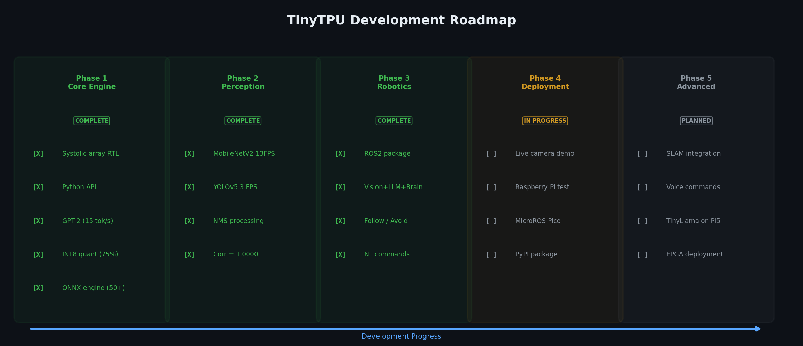
</p>

- [x] **Phase 1: Core Engine** — Systolic array RTL, Python API, GPT-2 at 15 tok/s, INT8 quantization, ONNX engine with 50+ ops
- [x] **Phase 2: Perception** — MobileNetV2 at 13 FPS, YOLOv5 at 3 FPS, NMS, output correlation 1.0 with ONNX Runtime
- [x] **Phase 3: Robotics** — ROS2 package, vision + LLM + brain nodes, follow/avoid/patrol, natural language commands
- [x] **Phase 4: Edge AI Framework** — Pip-installable package, HAL (Hailo/Coral/ONNX RT/NumPy), async pipeline, safety controller, Kalman tracker, model zoo, CLI (7 commands), end-to-end demo with real YOLOv8n at 7.3 FPS, live webcam detection + tracking
- [ ] **Phase 5: Deployment** — Model conversion (`tinytpu convert --target hailo8l`), FastAPI live dashboard, Raspberry Pi + Hailo hardware-in-the-loop testing, MicroROS for Pico
- [ ] **Phase 6: Advanced** — SLAM integration, voice commands, TinyLlama on Pi 5, FPGA synthesis, larger models (TinyLlama, Phi-2), TestPyPI / PyPI publication

---

## Use Cases

1. **Autonomous Robots**: Follow-mode, patrol, obstacle avoidance on Raspberry Pi
2. **Security Cameras**: Real-time detection with tracking and alerts
3. **Education**: Learn TPU architecture with real systolic array RTL
4. **Cheap LLM Inference**: Run GPT-2 at 15 tok/s without a GPU
5. **Hardware Prototyping**: Verified RTL for FPGA deployment
6. **Edge AI Research**: Experiment with quantization, Kalman tracking, safety systems

---

## Acknowledgments

- Numerical methods adapted from Killingbeck, *Microcomputer Algorithms* (1991)
- YOLO models by [Ultralytics](https://github.com/ultralytics/ultralytics)
- Inference powered by [ONNX Runtime](https://onnxruntime.ai/)
- Google TPU architecture papers
- HuggingFace for model weights

## Citation

```bibtex
@software{tinytpu2026,
  title   = {TinyTPU: Production Edge AI for Robots},
  author  = {SK Biswas},
  year    = {2026},
  url     = {https://github.com/SKBiswas1998/tinytpu},
  license = {MIT}
}
```

## License

[MIT](LICENSE) — Free for personal and commercial use.

---

<p align="center">
  <em>Built for robots that think at the edge.</em><br><br>
  <code>pip install tinytpu</code><br>
  <code>ai = EdgeAI.auto()</code><br>
  <code>result = ai.process(frame)</code>
</p>

<p align="center">
  Built with ☕ in Dhaka · <a href="https://github.com/SKBiswas1998/tinytpu/issues">Report Bug</a> · <a href="https://github.com/SKBiswas1998/tinytpu/issues">Request Feature</a>
</p>
